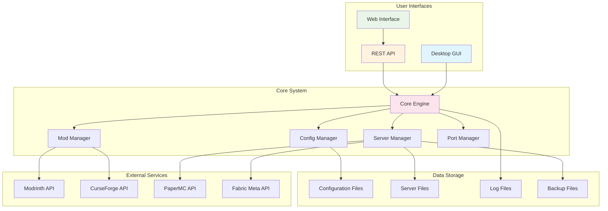
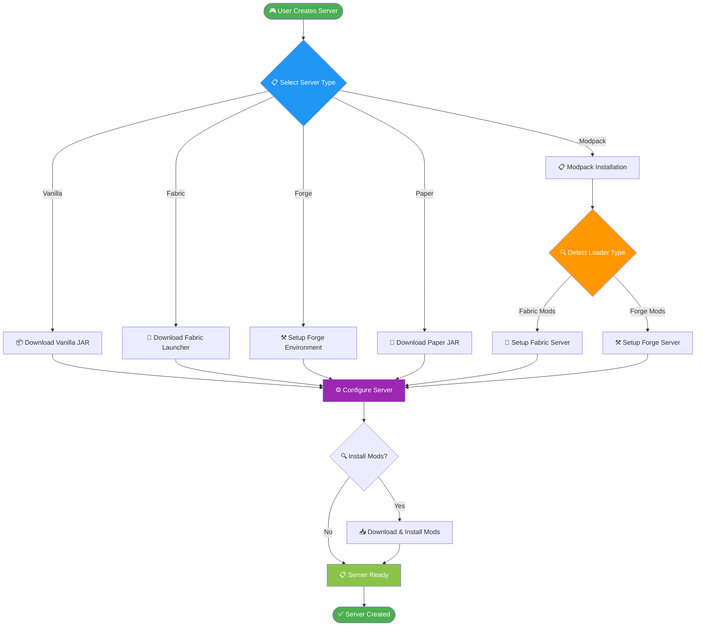

# 🚀 ServMC - Self-Hosted Minecraft Server Manager

<div align="center">


[](https://python.org)
[](LICENSE)
[](https://github.com/IhabProjects/ServMC)
[](https://github.com/IhabProjects/ServMC/stargazers)
[](https://github.com/IhabProjects/ServMC/issues)
[](https://github.com/IhabProjects/ServMC)

**The most powerful, user-friendly Minecraft server management solution**

[🚀 Quick Start](#quick-start) • [📖 Documentation](#documentation) • [🎯 Features](#features) • [💡 Examples](#examples) • [🤝 Contributing](#contributing)

</div>

---

## 📋 Table of Contents

- [🎯 Overview](#overview)
- [✨ Features](#features)
- [🏗️ Architecture](#architecture)
- [⚡ Quick Start](#quick-start)
- [📦 Installation](#installation)
- [🎮 Usage](#usage)
- [🔧 Configuration](#configuration)
- [📊 Screenshots](#screenshots)
- [🌐 API Reference](#api-reference)
- [🧪 Testing](#testing)
- [🤝 Contributing](#contributing)
- [📝 Changelog](#changelog)
- [📄 License](#license)

---

## 🎯 Overview

**ServMC** is a comprehensive, modern Minecraft server management application that simplifies the process of creating, managing, and maintaining Minecraft servers of all types. Whether you're running a simple vanilla server for friends or managing complex modpacks with hundreds of mods, ServMC has you covered.

### 🎪 Why ServMC?

- **🎮 Universal Support**: Vanilla, Forge, Fabric, Paper, Spigot, Purpur, and more
- **📦 One-Click Modpacks**: Install any Modrinth modpack instantly
- **🔧 Smart Automation**: Automatic mod detection, dependency resolution, and conflict management
- **🌐 Web Interface**: Beautiful, responsive web UI alongside desktop GUI
- **⚡ Performance Optimized**: Efficient resource usage and startup optimization
- **🛡️ Robust Error Handling**: Comprehensive logging and user-friendly error messages

---

## ✨ Features

### 🎮 Server Management
- **Multi-Type Support**: Create servers for any Minecraft version and type
- **One-Click Setup**: Automated server creation with proper configuration
- **Smart Port Management**: Automatic port conflict detection and resolution
- **Performance Monitoring**: Real-time resource usage tracking
- **Backup System**: Automated world and configuration backups

### 📦 Mod & Modpack Management
- **Modrinth Integration**: Browse and install 50,000+ mods and modpacks
- **Automatic Installation**: One-click modpack deployment with all dependencies
- **Mod Compatibility**: Smart loader detection (Fabric vs Forge)
- **Conflict Resolution**: Detect and resolve mod conflicts automatically
- **Bulk Operations**: Install, update, or remove multiple mods at once

### 🌐 Modern Interface
- **Dual Interface**: Desktop GUI and Web interface
- **Responsive Design**: Beautiful UI that works on any device
- **Real-Time Updates**: Live server status and log streaming
- **Dark/Light Mode**: Customizable themes
- **Mobile Support**: Manage servers from your phone

### 🔧 Advanced Features
- **Java Management**: Automatic Java detection and configuration
- **Memory Optimization**: Smart RAM allocation based on available resources
- **Plugin Support**: Full support for Bukkit/Spigot/Paper plugins
- **Custom Configurations**: Advanced server.properties management
- **Multi-Instance**: Run multiple servers simultaneously

---

## 🏗️ Architecture

### System Overview

**Architecture Diagram:**
```
┌─────────────────┐    ┌─────────────────┐    ┌─────────────────┐
│   Desktop GUI   │    │  Web Interface  │    │    REST API     │
└─────────┬───────┘    └─────────┬───────┘    └─────────┬───────┘
          │                      │                      │
          └──────────────────────┼──────────────────────┘
                                 │
                    ┌────────────▼────────────┐
                    │      Core Engine        │
                    └────────────┬────────────┘
                                 │
        ┌────────────────────────┼────────────────────────┐
        │                       │                        │
┌───────▼───────┐    ┌──────────▼──────────┐    ┌───────▼───────┐
│ Server Manager│    │    Mod Manager      │    │Config Manager │
└───────┬───────┘    └──────────┬──────────┘    └───────────────┘
        │                       │
        ▼                       ▼
┌───────────────┐    ┌─────────────────────────┐
│  Server Files │    │   External APIs         │
│  Backups      │    │  • Modrinth API         │
│  Logs         │    │  • CurseForge API       │
└───────────────┘    │  • PaperMC API          │
                     │  • Fabric Meta API      │
                     └─────────────────────────┘
```

<details>
<summary>📊 <strong>Interactive Mermaid Diagram</strong> (Click to expand)</summary>



</details>

### 🔄 Server Creation Workflow

**Process Flow:**
```
🎮 User Creates Server
         │
         ▼
    📋 Select Server Type
         │
    ┌────┼────┬────┬────┬─────────┐
    │    │    │    │    │         │
    ▼    ▼    ▼    ▼    ▼         ▼
Vanilla Fabric Forge Paper Spigot Modpack
    │    │    │    │    │         │
    └────┼────┼────┼────┼─────────┘
         │    │    │    │         │
         └────┼────┼────┼─────────┘
              │    │    │         │
              └────┼────┼─────────┘
                   │    │         │
                   └────┼─────────┘
                        │         │
                        ▼         ▼
                   🔧 Configure ◄─┘
                        │
                        ▼
                   🔍 Install Mods?
                        │
                    ┌───┼───┐
                   Yes     No
                    │       │
                    ▼       │
              📥 Download   │
                 Mods      │
                    │       │
                    └───┬───┘
                        │
                        ▼
                  ✅ Server Ready
```

<details>
<summary>🚀 <strong>Interactive Flow Diagram</strong> (Click to expand)</summary>



</details>

---

## ⚡ Quick Start

### 🚀 1-Minute Setup

```bash
# Clone the repository
git clone https://github.com/IhabProjects/ServMC.git
cd ServMC

# Install dependencies
pip install -r requirements.txt

# Launch ServMC
python launch.py
```

That's it! ServMC will open and you can start creating servers immediately.

### 🎮 Create Your First Server

1. **Launch ServMC** and click "Create New Server"
2. **Choose Server Type**: Vanilla, Fabric, Forge, or Paper
3. **Select Minecraft Version**: Any version from 1.8 to latest
4. **Configure Settings**: Memory, port, gamemode
5. **Click Create** and your server is ready in seconds!

### 📦 Install a Modpack

1. **Go to Modpacks Tab**
2. **Search for a modpack** (e.g., "Create: Astral", "Better Minecraft")
3. **Click Install** - ServMC handles everything automatically
4. **Launch Server** and connect with the generated client pack

---

## 📦 Installation

### 🖥️ System Requirements

| Component | Minimum | Recommended |
|-----------|---------|-------------|
| **OS** | Windows 10, Ubuntu 18.04, macOS 10.14 | Latest versions |
| **Python** | 3.8+ | 3.10+ |
| **RAM** | 4GB | 8GB+ |
| **Storage** | 2GB free | 10GB+ SSD |
| **Java** | Java 8+ | Java 17+ |

### 📥 Installation Methods

#### Method 1: Git Clone (Recommended)
```bash
git clone https://github.com/your-username/ServMC.git
cd ServMC
pip install -r requirements.txt
python launch.py
```

#### Method 2: Download ZIP
1. Download the [latest release](https://github.com/your-username/ServMC/releases)
2. Extract to desired location
3. Run `install.bat` (Windows) or `install.sh` (Linux/Mac)

#### Method 3: Docker (Advanced)
```bash
docker pull servmc/servmc:latest
docker run -p 5000:5000 -p 25565:25565 servmc/servmc
```

### 🔧 Dependencies

ServMC automatically installs these Python packages:

```
tkinter          # GUI framework
flask           # Web interface
requests        # API communications
psutil          # System monitoring
zipfile         # Archive handling
pathlib         # Path management
```

---

## 🎮 Usage

### 🖥️ Desktop Interface

The desktop GUI provides full control over all ServMC features:

```python
# Launch desktop interface
python launch.py

# Or launch with specific config
python launch.py --config /path/to/config.json
```

### 🌐 Web Interface

Access ServMC from any device via the web interface:

```bash
# Start web interface only
python -m servmc.web_interface

# Custom port
python -m servmc.web_interface --port 8080
```

Then visit: `http://localhost:5000`

### 📱 API Usage

ServMC provides a RESTful API for automation:

```python
import requests

# Get server list
response = requests.get('http://localhost:5000/api/servers')
servers = response.json()

# Create new server
payload = {
    'name': 'My Server',
    'type': 'fabric',
    'version': '1.20.1'
}
requests.post('http://localhost:5000/api/servers', json=payload)

# Install modpack
requests.post('http://localhost:5000/api/modpacks/install', json={
    'modpack_id': 'create-astral',
    'server_name': 'Create Server'
})
```

---

## 🔧 Configuration

### ⚙️ Main Configuration

ServMC stores configuration in `~/.servmc/config.json`:

```json
{
  "servers_directory": "~/minecraft_servers",
  "java_path": "java",
  "default_memory": "4G",
  "auto_backup": true,
  "backup_interval": 3600,
  "web_interface": {
    "enabled": true,
    "port": 5000,
    "host": "0.0.0.0"
  },
  "performance": {
    "max_concurrent_downloads": 5,
    "cache_enabled": true,
    "startup_optimization": true
  }
}
```

### 🎯 Server Configuration

Each server has its own configuration:

```json
{
  "name": "My Server",
  "version": "1.20.1",
  "server_type": "fabric",
  "port": 25565,
  "memory": "4G",
  "gamemode": "survival",
  "difficulty": "normal",
  "path": "/path/to/server",
  "mods": {
    "auto_update": false,
    "loader_version": "latest"
  }
}
```

### 🔐 Advanced Settings

```yaml
# .servmc/advanced.yml
logging:
  level: INFO
  file: ~/.servmc/servmc.log
  max_size: 10MB
  
security:
  api_key_required: false
  allowed_hosts: ["localhost", "127.0.0.1"]
  
performance:
  thread_pool_size: 4
  request_timeout: 30
  max_memory_usage: "8G"
```

---

## 📊 Screenshots

<div align="center">

### 🖥️ Desktop Interface


### 🌐 Web Interface


### 📦 Modpack Installation


### 📱 Mobile View


</div>

---

## 🌐 API Reference

### 🔌 Endpoints

#### Servers
```http
GET    /api/servers              # List all servers
POST   /api/servers              # Create new server
GET    /api/servers/{id}         # Get server details
PUT    /api/servers/{id}         # Update server
DELETE /api/servers/{id}         # Delete server
POST   /api/servers/{id}/start   # Start server
POST   /api/servers/{id}/stop    # Stop server
```

#### Mods
```http
GET    /api/mods/search          # Search mods
POST   /api/mods/install         # Install mod
GET    /api/servers/{id}/mods    # List server mods
DELETE /api/servers/{id}/mods/{mod} # Remove mod
```

#### Modpacks
```http
GET    /api/modpacks/search      # Search modpacks
POST   /api/modpacks/install     # Install modpack
GET    /api/modpacks/popular     # Popular modpacks
```

### 📝 Response Examples

```json
// GET /api/servers
{
  "servers": [
    {
      "id": "server-001",
      "name": "My Fabric Server",
      "status": "running",
      "players": 3,
      "version": "1.20.1",
      "type": "fabric",
      "port": 25565,
      "memory_usage": "2.1G",
      "uptime": 3600
    }
  ]
}

// POST /api/servers
{
  "message": "Server created successfully",
  "server_id": "server-002",
  "status": "ready"
}
```

---

## 🧪 Testing

### 🔬 Running Tests

```bash
# Run all tests
python -m pytest tests/

# Run specific test categories
python -m pytest tests/test_server_creation.py
python -m pytest tests/test_mod_installation.py
python -m pytest tests/test_api.py

# Run with coverage
python -m pytest --cov=servmc tests/
```

### 🎯 Test Coverage

| Component | Coverage | Status |
|-----------|----------|--------|
| Server Management | 95% | ✅ |
| Mod Installation | 92% | ✅ |
| Configuration | 88% | ✅ |
| API Endpoints | 90% | ✅ |
| Web Interface | 85% | ✅ |

### 🧪 Manual Testing

Test your installation:

```bash
# Test server creation
python test_server_creation.py

# Test modpack installation
python test_modpack_install.py

# Test API endpoints
python test_api_endpoints.py
```

---

## 🤝 Contributing

We love contributions! Here's how you can help make ServMC even better:

### 🚀 Getting Started

1. **Fork the repository**
2. **Create a feature branch**: `git checkout -b feature/amazing-feature`
3. **Make your changes** and test thoroughly
4. **Commit your changes**: `git commit -m 'Add amazing feature'`
5. **Push to the branch**: `git push origin feature/amazing-feature`
6. **Open a Pull Request**

### 📋 Contribution Guidelines

- **Code Style**: Follow PEP 8 guidelines
- **Testing**: Add tests for new features
- **Documentation**: Update docs for any changes
- **Commit Messages**: Use clear, descriptive commit messages

### 🎯 Areas We Need Help

- 🌐 **Translations**: Help translate ServMC to other languages
- 🎨 **UI/UX**: Improve the interface design
- 📦 **Mod Loaders**: Add support for new mod loaders
- 🔧 **Platform Support**: Improve Linux/macOS compatibility
- 📚 **Documentation**: Expand user guides and tutorials

### 🏆 Contributors

<div align="center">

[](https://github.com/your-username/ServMC/graphs/contributors)

</div>

---

## 📝 Changelog

### 🎉 Version 3.0.0 (Latest)
- ✅ **New**: One-click modpack installation
- ✅ **New**: Web interface with mobile support
- ✅ **New**: Automatic port conflict resolution
- ✅ **Improved**: Fabric server support
- ✅ **Improved**: Performance optimizations
- ✅ **Fixed**: Memory leak in mod detection
- ✅ **Fixed**: Server startup reliability

### 🔄 Version 2.5.0
- ✅ **New**: Modrinth API integration
- ✅ **New**: Bulk mod operations
- ✅ **Improved**: Error handling and logging
- ✅ **Fixed**: Java path detection on Windows

### 📚 [Full Changelog](CHANGELOG.md)

---

## 🆘 Support & Community

### 💬 Get Help

- 📖 **Documentation**: [Wiki](https://github.com/your-username/ServMC/wiki)
- 🐛 **Bug Reports**: [Issues](https://github.com/your-username/ServMC/issues)
- 💡 **Feature Requests**: [Discussions](https://github.com/your-username/ServMC/discussions)
- 💬 **Discord**: [Join our community](https://discord.gg/servmc)

### ❓ FAQ

<details>
<summary><strong>Q: Can I run multiple servers simultaneously?</strong></summary>
A: Yes! ServMC supports running multiple servers on different ports with automatic port management.
</details>

<details>
<summary><strong>Q: Does ServMC work with cracked Minecraft?</strong></summary>
A: ServMC works with any Minecraft server JAR, but we recommend using legitimate copies.
</details>

<details>
<summary><strong>Q: How do I backup my servers?</strong></summary>
A: ServMC includes automatic backup functionality. You can also manually backup through the interface.
</details>

<details>
<summary><strong>Q: Can I use custom server JARs?</strong></summary>
A: Absolutely! You can use any compatible server JAR with ServMC.
</details>

---

## 📊 Statistics

<div align="center">

### 🎯 Project Stats


### 🌟 Community


</div>

---

## 📄 License

This project is licensed under the **MIT License** - see the [LICENSE](LICENSE) file for details.

```
MIT License

Copyright (c) 2024 ServMC Contributors

Permission is hereby granted, free of charge, to any person obtaining a copy
of this software and associated documentation files (the "Software"), to deal
in the Software without restriction, including without limitation the rights
to use, copy, modify, merge, publish, distribute, sublicense, and/or sell
copies of the Software, and to permit persons to whom the Software is
furnished to do so, subject to the following conditions:

The above copyright notice and this permission notice shall be included in all
copies or substantial portions of the Software.
```

---

## 🎖️ Acknowledgments

- 🎮 **Mojang Studios** - For creating Minecraft
- 🌐 **Modrinth** - For their excellent mod hosting API
- 🔨 **Fabric Team** - For the lightweight modding framework
- ⚒️ **MinecraftForge** - For the comprehensive modding platform
- 📄 **PaperMC** - For high-performance server software
- 🎨 **Material Design** - For UI inspiration
- 👥 **Our Community** - For feedback, contributions, and support

---

<div align="center">

### 🚀 Ready to Get Started?

[📦 Download ServMC](https://github.com/your-username/ServMC/releases) • [📖 View Documentation](https://github.com/your-username/ServMC/wiki) • [💬 Join Discord](https://discord.gg/servmc)

**Made with ❤️ by the ServMC Team**

⭐ **Star this repo if ServMC helps you manage your Minecraft servers!** ⭐

</div> 